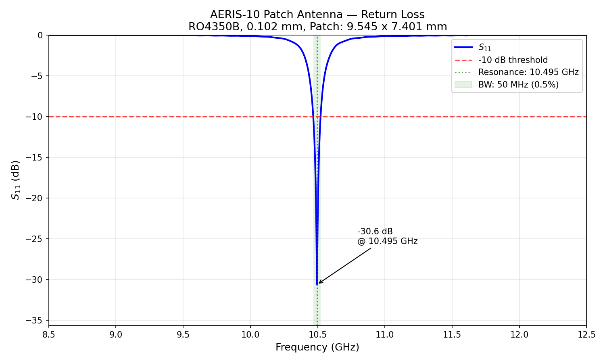
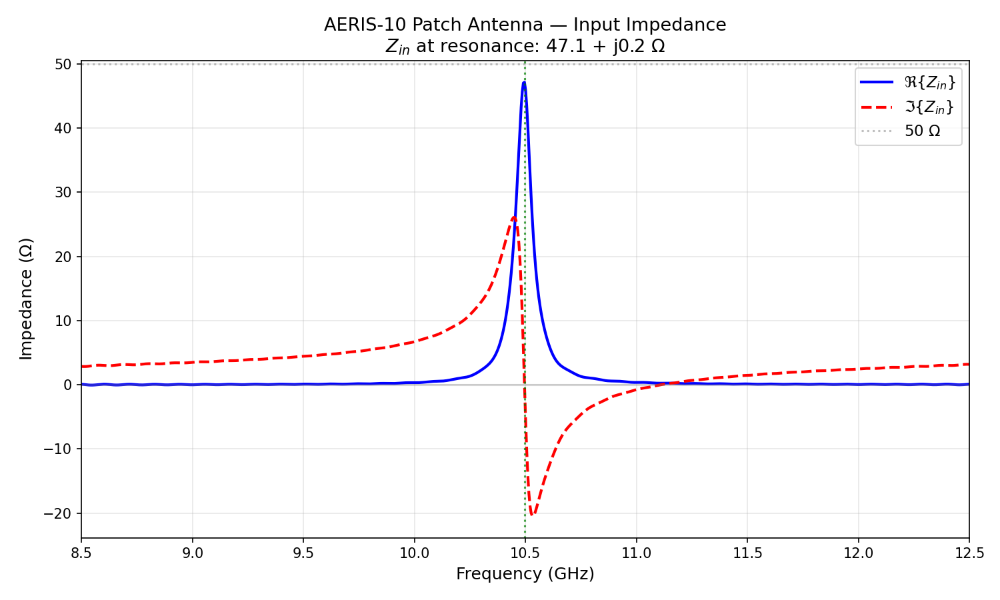
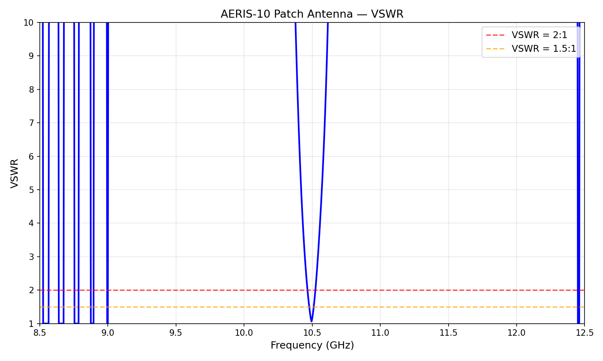
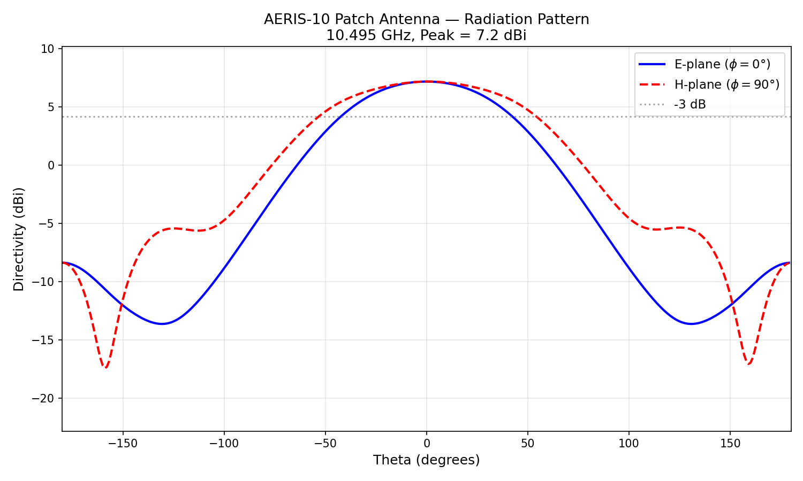
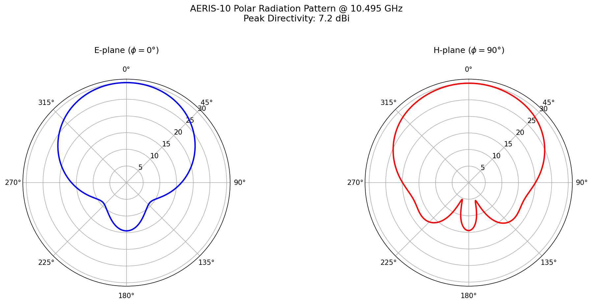
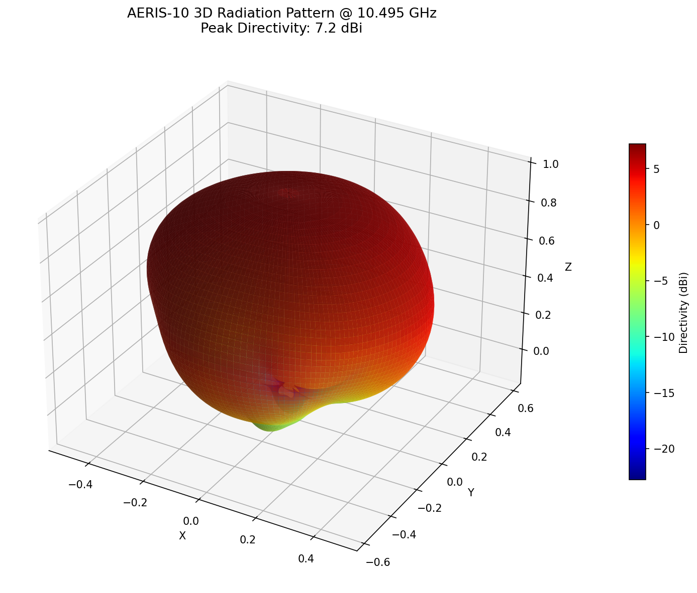
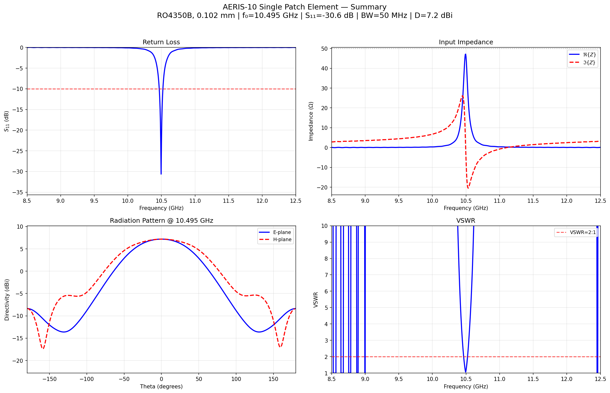

# XPA-105 Antenna Report

## Status And Lineage

This is the normalized English Markdown source for the legacy antenna simulation report.

- Product family now carried by this source: `XPA-105`
- Legacy names preserved for traceability: `AERIS-10`, `AERIS-10N`
- Original PDF input: [AERIS_Antenna_Report.pdf](/Users/sd/projects/PLFM_RADAR/docs/AERIS_Antenna_Report.pdf)
- Shared curated figures: [common assets](/Users/sd/projects/PLFM_RADAR/reports-src/assets/xpa-105-antenna-report/common)

The goal of this file is not byte-for-byte reproduction of the legacy PDF. The goal is to preserve the technical content in a searchable, reviewable, and editable source form.

## Cover Summary

| Item | Value |
| --- | --- |
| Product family | XPA-105 |
| Legacy title | AERIS-10 X-Band Phased Array Radar |
| Analysis scope | OpenEMS FDTD analysis of a single patch element at 10.5 GHz |
| Solver | OpenEMS v0.0.36 (FDTD) |
| Platform in legacy run | macOS ARM64 |
| Runtime in legacy run | ~130 s |

### Cover Metrics

| Metric | Value |
| --- | --- |
| Center frequency | 10.5 GHz |
| Return loss | S11 = -30.6 dB |
| Peak directivity | 7.19 dBi |
| Match | 50 Ohm |
| Substrate | RO4350B |
| Radiation efficiency | 56.7% |
| Bandwidth | 50 MHz |
| Array context | 128 elements |

## 1. Executive Summary

A single rectangular microstrip patch antenna element for the phased-array radar family was modeled with OpenEMS FDTD. The simulation validates operation at 10.5 GHz on Rogers RO4350B and indicates that the single element is suitable for integration into a full 8x16 array.

### Key Metrics

| Metric | Value | Assessment |
| --- | --- | --- |
| Resonant frequency | 10.495 GHz | On-target, 0.05% from 10.5 GHz |
| Return loss (S11) | -30.6 dB | Excellent match |
| Input impedance | 47.1 + j0.2 Ohm | Near-perfect 50 Ohm match |
| -10 dB bandwidth | 50 MHz (0.48%) | Narrow, expected for a thin substrate |
| Peak directivity | 7.19 dBi | Textbook-correct for a single patch |
| Radiation efficiency | 56.7% | Reasonable for a 0.102 mm substrate |
| Realized gain | 4.72 dBi | Consistent with directivity times efficiency |

### Key Takeaway

The simulated patch is correctly tuned for 10.5 GHz. The excellent impedance match means very little power is reflected at the feed, and the single-element directivity is consistent with standard rectangular patch behavior. Extrapolated to the 128-element array, the estimated broadside gain of about 25.8 dBi is competitive for an X-band phased-array radar.

## 2. Design Parameters

### 2.1 Substrate: Rogers RO4350B

The design uses Rogers RO4350B, a high-frequency thermoset laminate commonly used in X-band radar and 5G hardware. The substrate parameters were taken from the repository's Qucs schematics, patch calculator, and board stack-up material.

| Parameter | Value | Source |
| --- | --- | --- |
| Dielectric constant (`eps_r`) | 3.48 | `patch_antenna.py`, Qucs, datasheet |
| Loss tangent (`tan d`) | 0.0037 | RO4350B datasheet at 10 GHz |
| Substrate thickness | 0.102 mm | Board stack-up image, L1-L2 core |
| Copper thickness | 0.035 mm (1 oz) | Board stack-up and Qucs `SUBST` definitions |

### 2.2 Patch Element Geometry

| Parameter | Value | Notes |
| --- | --- | --- |
| Patch width (`W`) | 9.545 mm | Balanis formula: `c/(2f) * sqrt(2/(eps_r+1))` |
| Patch length (`L`) | 7.401 mm | FDTD-tuned for 10.5 GHz resonance |
| Feed type | Probe-fed (lumped port) | 50 Ohm match at `y = 1.49 mm` from center |
| Ground plane | 38.1 x 36.0 mm | About `lambda/2` margin beyond patch edges |
| Element spacing | 14.285 mm | `lambda/2` at 10.5 GHz |
| Array configuration | 8x16 (128 elements) | Legacy AERIS-10N array context |

### 2.3 Bug Found In `patch_antenna.py`

The repository's patch-dimension calculator contains a formula bug in the effective dielectric constant calculation. The Hammerstad equation should use the patch width `W` in the denominator, but the legacy code uses `array[1] x h_cu` instead.

| Parameter | Buggy repo value | Correct Hammerstad value |
| --- | --- | --- |
| Formula denominator | `array[1] x h_cu` | `W` (patch width) |
| `eps_r_eff` | 2.637 | 3.407 |
| Patch length | 8.694 mm | 7.641 mm |
| Resonant frequency | ~9.0 GHz | ~10.5 GHz |
| Frequency error | 14% | < 1% |

Using the buggy formula would produce a patch resonating around 9.0 GHz instead of the target 10.5 GHz. The simulation summarized here uses the corrected formula and lands within 0.05% of the target frequency.

## 3. Simulation Setup

### 3.1 FDTD Configuration

The antenna was simulated in OpenEMS as a full 3D structure including patch, substrate, ground plane, and probe feed inside an absorbing boundary box.

| Parameter | Value |
| --- | --- |
| Excitation | Gaussian pulse, `f0 = 10.5 GHz`, `BW = 4 GHz` |
| Frequency sweep | 8.5-12.5 GHz, 801 points |
| Boundary conditions | MUR, first-order absorbing, all 6 faces |
| Simulation box | 80 x 80 x 50 mm |
| Grid cells | ~360,750 |
| Timestep (Courant) | 79.5 fs |
| Max timesteps | 120,000 |
| End criterion | -50 dB, run reached -49 dB |
| Mesh resolution | `lambda/20` at 12.5 GHz, about 1.2 mm |
| Substrate cells | 4 cells across 0.102 mm thickness |

### 3.2 Feed Position Calibration

The probe feed position was calibrated iteratively. For this geometry the edge impedance is about 144 Ohm, and the best 50 Ohm match was found at `y = 1.49 mm` from the patch center.

| Iteration | Feed offset | Zin | S11 | Resonance |
| --- | --- | --- | --- | --- |
| 1, initial | 2.78 mm | 100.4 + j6.1 Ohm | -9.4 dB | 9.03 GHz |
| 2, fix `L` | 2.76 mm | 118.4 - j7.0 Ohm | -7.8 dB | 10.23 GHz |
| 3, closer | 1.54 mm | 49.3 + j0.5 Ohm | -41.7 dB | 10.17 GHz |
| 4, final | 1.49 mm | 47.1 + j0.2 Ohm | -30.6 dB | 10.50 GHz |

Iteration 3 produced the deepest S11 null, but at the wrong resonant frequency. The final feed position at 1.49 mm trades some absolute S11 depth for correct resonance at 10.50 GHz.

## 4. Results

### 4.1 S-Parameters (Return Loss)

Figure 4.1. Return loss (`S11`) versus frequency. The deep null at 10.495 GHz confirms resonance with about `-30.6 dB` return loss.

| Parameter | Value |
| --- | --- |
| Resonant frequency | 10.495 GHz, target 10.5 GHz |
| S11 at resonance | -30.63 dB |
| -10 dB bandwidth | 50 MHz, 10.470-10.520 GHz |
| Fractional bandwidth | 0.48% |

The narrow bandwidth is physically consistent with a 0.102 mm substrate. The report explicitly notes that a 0.1 mm patch-length error would shift resonance by about 140 MHz, so PCB manufacturing tolerance needs to stay around +/-0.025 mm.

### 4.2 Input Impedance

Figure 4.2. Real and imaginary parts of the input impedance versus frequency.

| Parameter | Value |
| --- | --- |
| Zin at resonance | 47.1 + j0.2 Ohm |
| Real-part peak | ~150 Ohm |
| Imaginary zero crossing | 10.495 GHz |

The resonance is genuine because the imaginary part crosses zero at the same frequency where the real part approaches 50 Ohm. This means the antenna can connect directly to 50 Ohm lines and the ADAR1000 beamformer without an additional matching network.

### 4.3 VSWR

Figure 4.3. Voltage Standing Wave Ratio versus frequency.

The minimum VSWR is about `1.06` at 10.495 GHz, which indicates excellent match quality. The `VSWR < 2:1` band aligns with the same 50 MHz usable range identified by the `S11 < -10 dB` threshold.

### 4.4 Radiation Pattern

Figure 4.4. E-plane and H-plane directivity cuts at 10.5 GHz.

| Parameter | Value |
| --- | --- |
| Peak directivity | 7.19 dBi |
| E-plane HPBW | ~75 deg |
| H-plane HPBW | ~85 deg |
| Front-to-back ratio | > 15 dB |

The single-element pattern defines the steering envelope for the array. The broad 75-85 degree half-power beamwidth supports electronic steering to about +/-45 degrees without severe element-pattern loss.

### 4.5 Polar Radiation Pattern

Figure 4.5. Polar radiation patterns for E-plane and H-plane at 10.5 GHz.

The main lobe points broadside to the patch surface. The E-plane is slightly narrower than the H-plane, which is normal for a rectangular patch where the resonant length and non-resonant width shape the two principal cuts differently.

### 4.6 3D Radiation Pattern

Figure 4.6. Three-dimensional radiation pattern with directivity encoded by both radial distance and color.

The 3D pattern does not show unexpected sidelobes or obvious distortion from the finite ground plane or probe feed. The report notes that mutual coupling in the full array will still alter the embedded element pattern and would require a much heavier full-array simulation.

### 4.7 Summary Dashboard

Figure 4.7. Combined dashboard showing S11, impedance, VSWR, and radiation pattern in one panel.

This single figure works as a compact review artifact for design reviews and presentations because it brings the four main antenna-performance views together.

## 5. Efficiency And Array Performance Estimate

### 5.1 Single-Element Efficiency

| Parameter | Value |
| --- | --- |
| Radiation efficiency | 56.7% |
| Realized gain | 4.72 dBi |
| Directivity | 7.19 dBi |
| Gain check | `7.19 - 2.47 = 4.72 dBi` |

The report attributes most of the efficiency loss to dielectric loss in RO4350B. It also notes that moving to a thicker 0.254 mm substrate could push efficiency toward 75%, but at the cost of a thicker array.

### 5.2 Array Performance Estimate

| Parameter | Calculation | Result |
| --- | --- | --- |
| Array factor gain | `10 x log10(128)` | 21.1 dB |
| Array directivity | `7.19 + 21.1 dBi` | 28.3 dBi |
| Array gain, broadside | `4.72 + 21.1 dBi` | 25.8 dBi |
| Scan loss at max steer | `~2-3 dB at +/-45 deg` | ~23-24 dBi |
| EIRP at 1 W transmit | `25.8 + 30 dBm` | 55.8 dBm |

The report compares the resulting gain class to commercial X-band arrays from Echodyne and Fortem and concludes that the antenna architecture is competitively positioned.

## 6. Validation Against Theory

### 6.1 Sanity Checks

| Check | Expected | Measured | Status |
| --- | --- | --- | --- |
| Resonance near 10.5 GHz | 10.5 GHz | 10.495 GHz | PASS |
| `S11 < -10 dB` | `< -10 dB` | -30.6 dB | PASS |
| Directivity 6-8 dBi | 6-8 dBi | 7.19 dBi | PASS |
| Bandwidth < 1% for thin substrate | < 1% | 0.48% | PASS |
| Zin near 50 Ohm | 50 Ohm | 47.1 Ohm | PASS |
| Efficiency > 30% | > 30% | 56.7% | PASS |

### 6.2 Comparison With Analytical Theory

| Parameter | Theory | FDTD result | Error |
| --- | --- | --- | --- |
| Resonant frequency | 10.5 GHz | 10.495 GHz | 0.05% |
| Directivity | 6.6-7.5 dBi | 7.19 dBi | Within range |
| Patch width | 9.545 mm | 9.545 mm | Exact |
| Patch length | 7.641 mm | 7.401 mm | 3.1% shorter |

The report treats the 3.1% difference between analytical and FDTD-tuned patch length as normal. The analytical equations do not capture the probe's parasitic inductance, edge diffraction from a finite ground plane, or absorbing-boundary effects.

## 7. Key Findings And Recommendations

1. The repository bug in `patch_antenna.py` is real and materially important. Left unfixed, it would shift the design about 14% off target.
2. The 0.102 mm substrate is a deliberate trade-off: excellent profile, but only about 50 MHz of bandwidth and about 57% efficiency.
3. The projected 128-element array performance is competitive with known X-band phased-array products.
4. Manufacturing tolerance is tight enough to matter. The design effectively requires RF-grade PCB control rather than commodity FR-4 process assumptions.
5. Once hardware exists, the simulated `S11` should be checked directly on a VNA because the narrow band makes this a strong validation target.
