# XPA-105 Simulation Report

## Status And Lineage

This is the normalized English Markdown source for the legacy full-chain simulation report.

- Product family now carried by this source: `XPA-105`
- Legacy names preserved for traceability: `AERIS-10`, `AERIS-10N`, `AERIS-10X`
- Original PDF input: [AERIS_Simulation_Report.pdf](/Users/sd/projects/PLFM_RADAR/docs/AERIS_Simulation_Report.pdf)
- Shared curated figures: [common assets](/Users/sd/projects/PLFM_RADAR/reports-src/assets/xpa-105-simulation-report/common)

The goal of this file is not byte-for-byte reproduction of the legacy PDF. The goal is to preserve the technical content in a searchable, reviewable, and editable source form.

## Cover Summary

| Item | Value |
| --- | --- |
| Product family | XPA-105 |
| Legacy title | AERIS-10 X-Band Phased Array Radar |
| Report scope | Full-chain signal processing simulation with hardware correlation analysis |
| Center frequency | 10.5 GHz |
| Chirp bandwidth | 500 MHz |
| Array context | 16 elements |
| Range resolution | 0.30 m |
| Velocity resolution | 2.67 m/s |
| ADC path | 400 MSPS ADC, 8-bit AD9484 |

## 1. Introduction And Simulation Overview

This report presents the results of a full-chain signal processing simulation of the AERIS-10 X-band phased array radar. Every parameter used in the simulation, including center frequency, chirp bandwidth, ADC sample rate, array geometry, beamforming weights, and timing, was extracted directly from the PLFM_RADAR hardware design files.

The simulation models the complete radar signal chain: FMCW chirp generation, target echo propagation with radar-equation amplitude, Doppler shift and spatial phase, dechirp mixing, ADC sampling, range FFT, Doppler FFT, conventional beamforming across 16 antenna elements, and CA-CFAR target detection.

Two operational scenarios are evaluated:

- a basic demo scenario with three well-separated targets for investor presentation use
- a counter-UAS scenario with five small drones at varying ranges and speeds

## 2. System Parameters (Hardware-Derived)

The table below captures the hardware-derived simulation baseline.

| Parameter | Value | Hardware Source |
| --- | --- | --- |
| Center frequency | 10.5 GHz | ADF4382A synth, antenna design |
| Chirp bandwidth | 500 MHz (10.25-10.75 GHz) | ADF4382A registers |
| Chirp duration (long) | 30 µs | STM32 firmware (`T1 = 30.0`) |
| Chirp duration (short) | 0.5 µs | STM32 firmware (`T2 = 0.5`) |
| PRI (long / short) | 167 / 175 µs | STM32 firmware (`PRI1`, `PRI2`) |
| Chirps per beam position | 32 | STM32 firmware (`m_max = 32`) |
| ADC sample rate | 400 MSPS | AD9484; AD9523-1 OUT4 = VCO/9 |
| ADC resolution | 8 bits | AD9484 datasheet |
| IF frequency | 120 MHz | STM32 firmware (`IF_freq = 120 MHz`) |
| FPGA system clock | 100 MHz | AD9523-1 OUT6 = VCO/36 |
| DAC clock | 120 MHz | AD9523-1 OUT10 = VCO/30 |
| VCO frequency | 3.6 GHz | AD9523-1: 100 MHz VCXO x 36 |
| Array elements | 16 (4 x 4) | 4 x ADAR1000, 4 elements each |
| Element spacing | `λ/2 = 14.29 mm` | Antenna layout at 10.5 GHz |
| Beam positions (el x az) | 31 x 50 | STM32 firmware (`n_max`, `y_max`) |
| Stepper motor | 200 steps/rev | STM32 firmware (`Stepper_steps`) |
| TX power (per PA) | ~33 dBm | QPA2962 GaN PA, `VDD = 22 V` |
| PA drain current (`Idq`) | 1.68 A | Auto-bias loop in firmware |
| Range resolution | 0.30 m | `c / (2 x BW)` |
| Velocity resolution | 2.67 m/s | `λ / (2 x CPI)` |
| Max unambiguous velocity | ±42.8 m/s | `λ / (4 x PRI)` |
| Max unambiguous range | 1,800 m | `c x T x (f_ADC/2) / (2 x BW)` |

Hardware correlation note: the AD9523-1 clock generator is the timing backbone of the system. Its 3.6 GHz VCO distributes phase-coherent clocks to ADC, synth, DAC, and FPGA domains, and the simulation uses these exact clock ratios.

## 3. Signal Processing Chain

The simulation models eight processing stages, each mapped to a physical hardware subsystem on the board.

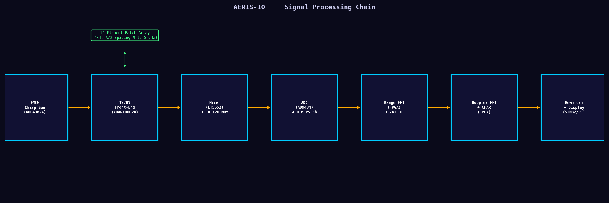

Figure 3.1. Signal processing chain with one hardware-mapping reference per stage.

| Stage | Simulation Function | Hardware Component | Key Spec |
| --- | --- | --- | --- |
| 1. Chirp generation | `generate_fmcw_chirp()` | ADF4382A + AD9523-1 | `BW = 500 MHz`, `T = 30 µs` |
| 2. Target echo | `generate_target_echo()` | Antenna + propagation | Radar equation, spatial phase |
| 3. Dechirp mixing | Beat-frequency model | LT5552 mixer | `IF = 120 MHz` |
| 4. ADC sampling | `add_noise()` + `quantize_adc()` | AD9484 | 400 MSPS, 8-bit |
| 5. Range FFT | `range_fft()` | XC7A100T FPGA | 512-point FFT at 100 MHz |
| 6. Doppler FFT | `doppler_fft()` | XC7A100T FPGA | 32-point FFT across chirps |
| 7. Beamforming | `beamform_conventional()` | ADAR1000 + FPGA | 16 elements, `λ/2` spacing |
| 8. Detection | `cfar_2d()` | FPGA / STM32 | 2D CA-CFAR, 13 dB threshold |

## 4. Scenario A — Basic Demo (3 Targets)

This scenario simulates three well-separated targets chosen for clear visual presentation during investor demos.

| Target | Range | Velocity | Azimuth | RCS | Description |
| --- | --- | --- | --- | --- | --- |
| T0 | 200 m | +10 m/s | 0° (boresight) | +5 dBsm | Close, approaching, on-axis |
| T1 | 600 m | -5 m/s | +20° | 0 dBsm | Medium range, receding, off-axis |
| T2 | 1000 m | 0 m/s | -15° | +10 dBsm | Far, stationary, off-axis |

CFAR detection results: 25 cells detected, all clustering around the 200 m target. The 600 m and 1000 m targets are visible in the range-Doppler map but remain below CFAR threshold in the element-averaged view.

### 4.1 TX Chirp Waveform

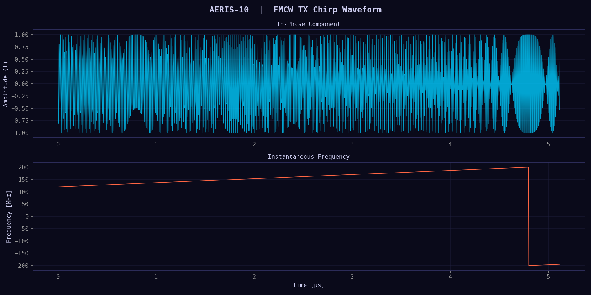

Figure 4.1. FMCW transmit chirp with in-phase component and instantaneous frequency sweep.

What it shows: a clean linear sweep over 500 MHz in 30 µs, corresponding to a chirp slope of 16.67 THz/s. In FMCW radar, beat frequency after mixing is what encodes target range.

Hardware correlation: the chirp is generated by the ADF4382A fractional-N PLL synthesizer referenced from AD9523-1, with MCU timing from STM32F746 TIM1.

### 4.2 Range-Doppler Map

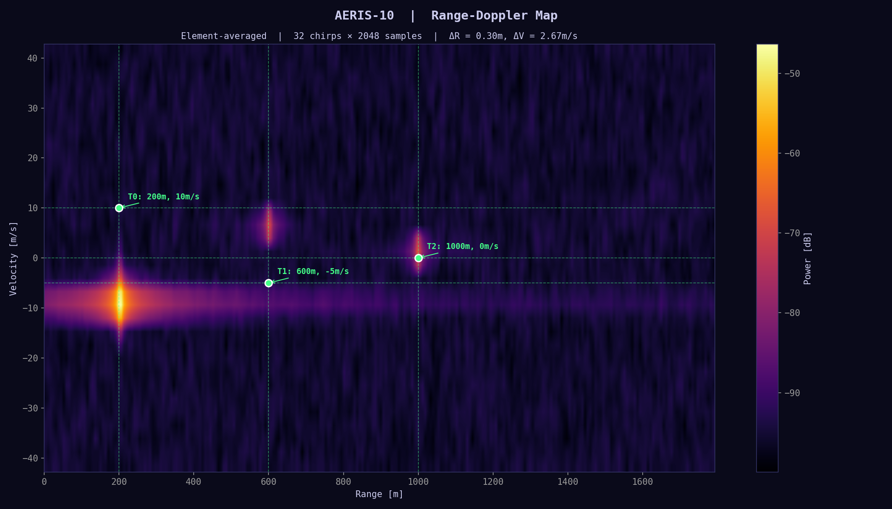

Figure 4.2. Element-averaged Range-Doppler map with true target positions marked.

What it shows: the standard FMCW output plane where horizontal position is range and vertical position is radial velocity. It comes from a range FFT on each chirp followed by Doppler FFT across the CPI.

Hardware correlation: range FFT and Doppler FFT map directly to FPGA processing driven by AD9484 sample capture and AD9523-1 clocking.

### 4.3 Range Profile

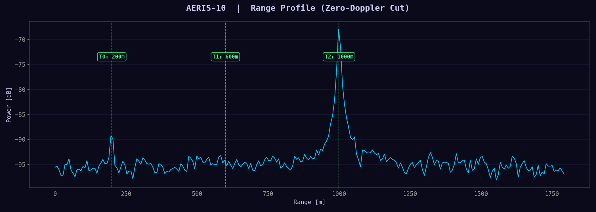

Figure 4.3. Zero-Doppler range cut.

What it shows: a stationary-target view emphasizing the target at 1000 m. Range resolution is set by chirp bandwidth and evaluates to 0.30 m.

Hardware correlation: the quality of this profile depends on chirp linearity and sweep cleanliness in ADF4382A and its reference chain.

### 4.4 Doppler Spectrum

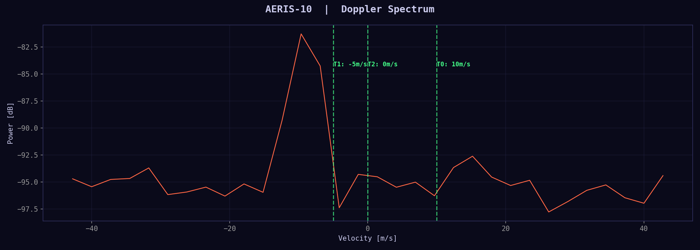

Figure 4.4. Doppler cut at the strongest range bin.

What it shows: the radial-velocity spectrum for the strongest target, with 2.67 m/s resolution and ±42.8 m/s maximum unambiguous velocity.

Hardware correlation: the CPI depends on coherent timing through the OCXO → AD9523-1 → ADF4382A chain.

### 4.5 Array Beam Pattern

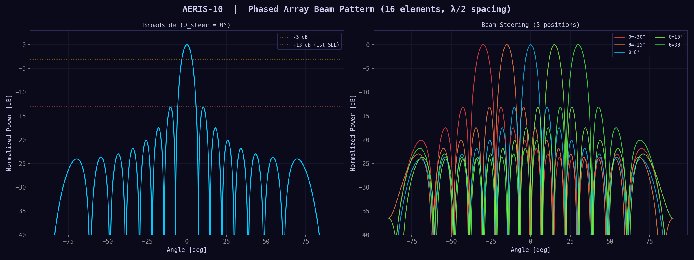

Figure 4.5. Broadside beam and five steered beams.

What it shows: a 16-element linear-array factor with approximately ±3.6° 3 dB beamwidth at broadside and first sidelobes near -13 dB.

Hardware correlation: beam steering maps to the 4 x ADAR1000 analog beamformers programmed by STM32 over SPI.

### 4.6 Range-Angle Map

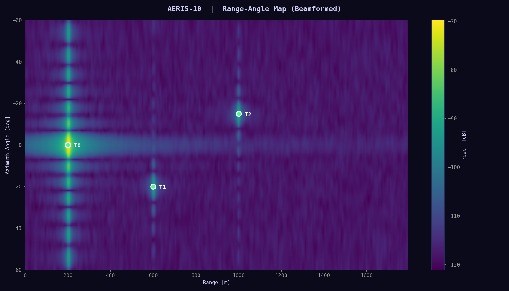

Figure 4.6. Beamformed range-angle output.

What it shows: target location in both range and azimuth. The approximately 7.2° angular resolution matches the mechanical azimuth step size used by the system.

Hardware correlation: the physical implementation is hybrid analog-digital beamforming using ADAR1000 at RF and FPGA for digital post-processing.

### 4.7 CFAR Detection

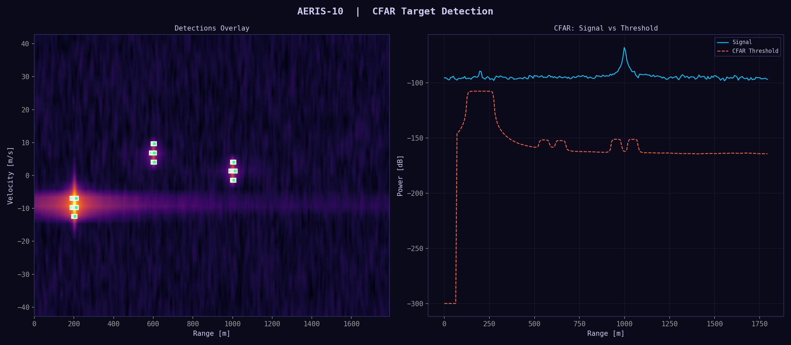

Figure 4.7. CFAR overlay and threshold comparison.

What it shows: adaptive thresholding over local noise using a 2D Cell-Averaging CFAR configuration.

Hardware correlation: the repo already includes a Verilog CFAR module intended to run in the FPGA processing chain.

### 4.8 Signal Processing Chain Diagram

Figure 4.8. End-to-end processing pipeline with hardware IC mapping.

What it shows: the signal flow from chirp generation through display, split across analog RF, mixed-signal, and digital domains.

Hardware correlation: the physical system spans synth, beamformer, digital, and power boards; the repo has schematics for all four boards, but fabrication artifacts are incomplete.

### 4.9 Polar Antenna Pattern

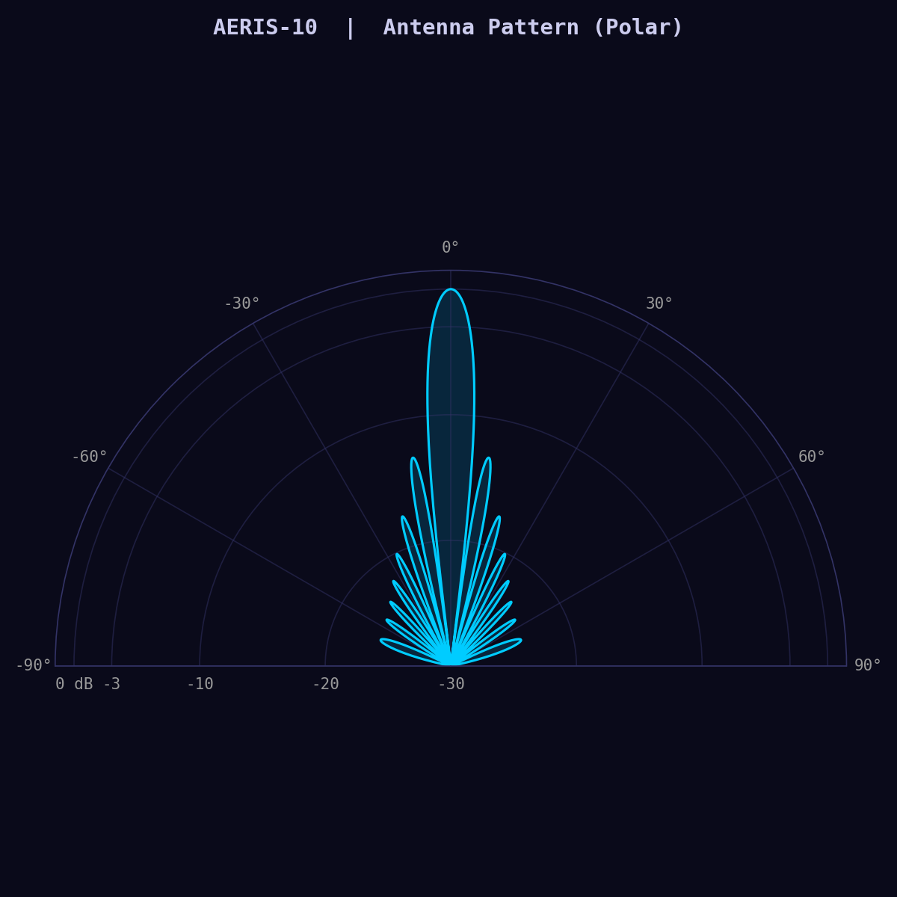

Figure 4.9. Polar view of the broadside array factor.

What it shows: the same broadside pattern in polar coordinates, making sidelobes and nulls easier to inspect.

Hardware correlation: the intended antenna is a 16-element microstrip patch array; the ADALM-PHASER kit is noted as an intermediate validation platform.

### 4.10 CPI Timing Diagram

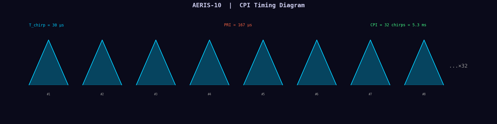

Figure 4.10. CPI timing with 32 chirps at 167 µs PRI.

What it shows: one coherent processing interval, giving a total CPI of 5.34 ms and implying a full-scan revisit of about 8.3 s for the full hemisphere pattern.

Hardware correlation: CPI timing is driven by STM32F746 GPIO and TIM1 orchestration.

### 4.11 Summary Dashboard

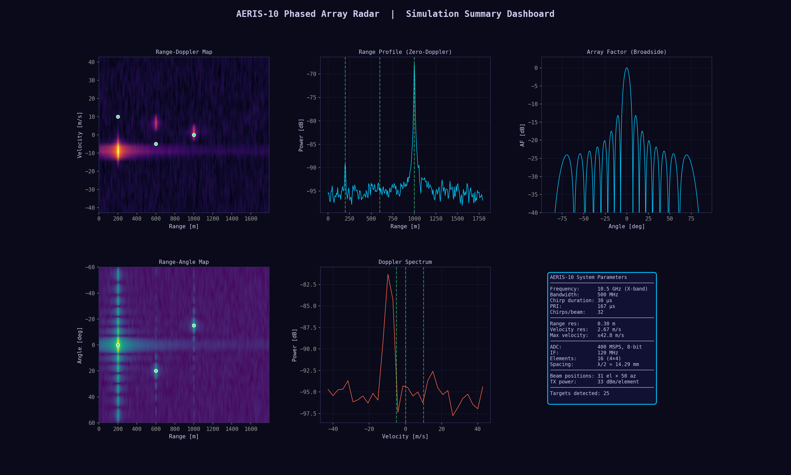

Figure 4.11. Combined simulation dashboard for the demo scenario.

What it shows: the consolidated investor-facing view of range, velocity, angle, and system parameters in one panel.

Hardware correlation: this dashboard mirrors the Python GUI lineage in the repo and the live-display style used by ADALM-PHASER examples.

## 5. Scenario B — Counter-UAS (5 Drone Targets)

Counter-UAS is the primary commercial market described by the legacy report, so this scenario focuses on realistic small-drone targets with low RCS and larger ranges.

| Target | Range | Velocity | Azimuth | RCS | Description |
| --- | --- | --- | --- | --- | --- |
| T0 | 500 m | +15 m/s | +5° | -10 dBsm | Small drone, approaching fast |
| T1 | 1200 m | -8 m/s | -20° | -5 dBsm | Medium drone, receding |
| T2 | 300 m | +25 m/s | +12° | -15 dBsm | Tiny drone, very fast |
| T3 | 2000 m | 0 m/s | 0° | +5 dBsm | Large drone, hovering at max range |
| T4 | 800 m | -3 m/s | -8° | -8 dBsm | Small drone, slow drift |

CFAR detection results: only 3 cells are detected, all around T0 at 500 m. The report’s key insight is that element-averaged detection without directed beamforming is limited to about 500 m for a -10 dBsm target, while full 16-element beamforming extends this to about 800-1000 m.

### 5.1 Range-Doppler Map

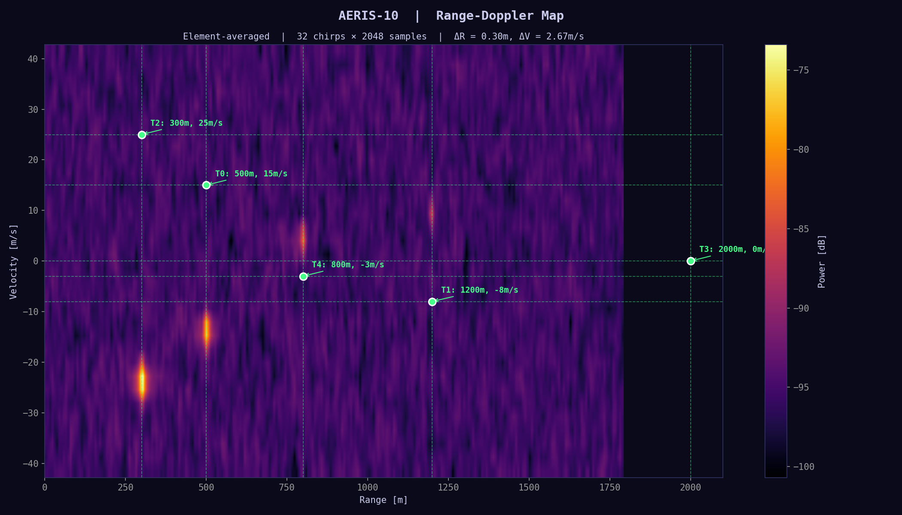

Figure 5.1. Counter-UAS Range-Doppler map.

What it shows: five drone targets with very different detectability; the 500 m target dominates while weaker or farther drones are much closer to the noise floor.

Hardware correlation: practical detection at this class depends on the full gain chain: antenna gain, PA output, receiver noise, and FFT processing gain.

### 5.2 Range Profile

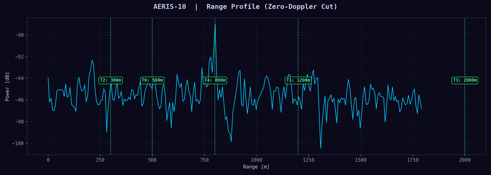

Figure 5.2. Zero-Doppler range profile for counter-UAS.

What it shows: a strong path-loss example where the hovering 2000 m target is much weaker than near targets.

Hardware correlation: the long-range variant described in the report uses QPA2962 GaN PAs and higher-gain antenna assumptions.

### 5.3 Doppler Spectrum

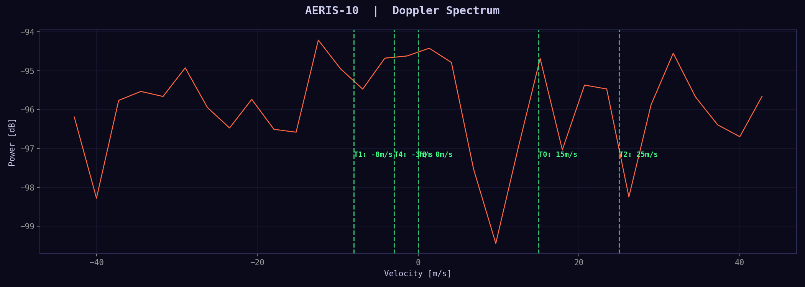

Figure 5.3. Doppler spectrum at the 500 m drone range bin.

What it shows: the +15 m/s drone response and the velocity-resolution limits of the CPI.

Hardware correlation: the same Doppler chain naturally supports MTI-style clutter discrimination and opens the path to micro-Doppler interpretation.

### 5.4 Range-Angle Map

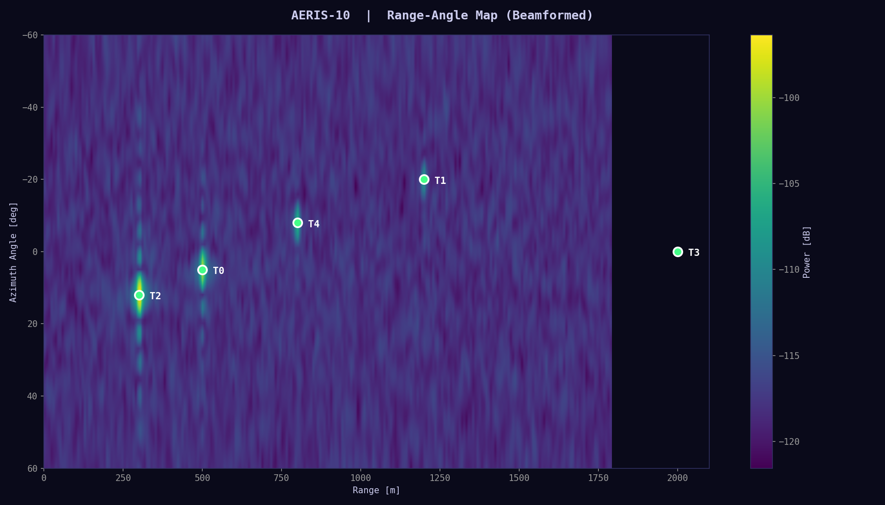

Figure 5.4. Counter-UAS range-angle map.

What it shows: the angular separation of drone targets, with approximately 7° coarse resolution and the motivation for monopulse refinement.

Hardware correlation: ADAR1000 amplitude-and-phase control is the enabling hardware for monopulse or sum/difference beam methods.

### 5.5 CFAR Detection

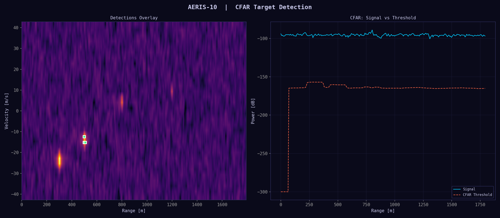

Figure 5.5. CFAR result for counter-UAS.

What it shows: a more realistic low-SNR detection regime where only the 500 m target exceeds the adaptive threshold.

Hardware correlation: the report describes three upgrade paths: more elements, longer CPI, or GaN PAs, all without redesigning the digital backend.

### 5.6 Summary Dashboard

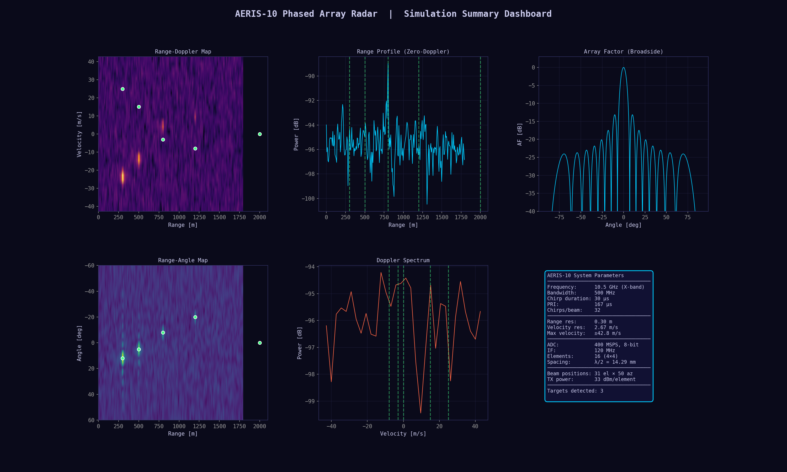

Figure 5.6. Counter-UAS summary dashboard.

What it shows: a six-panel view of the harder C-UAS problem, with weaker targets and a more prominent noise floor than the demo scenario.

Hardware correlation: this panel is intended as a high-level defense/security briefing surface rather than a live-hardware proof by itself.

## 6. Hardware Correlation Summary

| Simulation Output | Hardware Component(s) | Validates | Requires HW Test |
| --- | --- | --- | --- |
| TX chirp waveform | ADF4382A + AD9523-1 | Chirp linearity, timing, BW | Phase noise, spectral purity, spurs |
| Range FFT / profile | AD9484 ADC + FPGA | Range resolution, bin mapping | ADC SFDR, quantization noise, clock jitter |
| Doppler FFT / spectrum | FPGA + OCXO | Velocity resolution, max velocity | Inter-chirp phase coherence, OCXO stability |
| Beam pattern | ADAR1000 x4 + antenna | Array factor, steering range | Mutual coupling, element mismatch, scan loss |
| Range-angle map | ADAR1000 + FPGA | Angular resolution, beam gain | Real antenna patterns, near-field effects |
| CFAR detection | FPGA + STM32 | Detection threshold, `Pfa` | Clutter statistics, multipath, interference |
| CPI timing | STM32 TIM1 + GPIO | Frame rate, update time | Jitter, latency, ISR overhead |
| Noise model | LNA + mixer + ADC | SNR estimates, range limits | Actual NF, gain flatness, I/Q imbalance |

The rightmost column defines the specific measurements still needed from live hardware, including ADALM-PHASER validation and future XPA-105 prototype work.

## 7. Demo Readiness Assessment

| Demo Element | Source | Status | Investor Impact |
| --- | --- | --- | --- |
| FMCW signal processing theory | This simulation | READY | Shows deep technical understanding of the radar chain |
| Range-Doppler-angle resolution | Simulation figures | READY | Quantifies capability and limits |
| Live beam steering at 10.5 GHz | ADALM-PHASER kit | PENDING HW | HIGH — strongest live pitch element |
| Live target detection | ADALM-PHASER + IWR1443 | PENDING HW | HIGH — visceral proof in front of an investor |
| FPGA real-time processing | Arty A7-100T + Verilog | PENDING HW | MEDIUM — shows the design runs on real silicon |
| Counter-UAS detection-range analysis | This simulation | READY | Honest capability and limit assessment |
| Hardware cost validation | Business proposal BOM | READY | Supports the 5-10x price advantage claim |
| System architecture walkthrough | Block diagram + schematics | READY | Shows a real, complete hardware design exists |

Bottom line: the simulation package plus the business proposal provide the analytical base for an investor pitch. Live hardware remains the next decisive proof layer.
