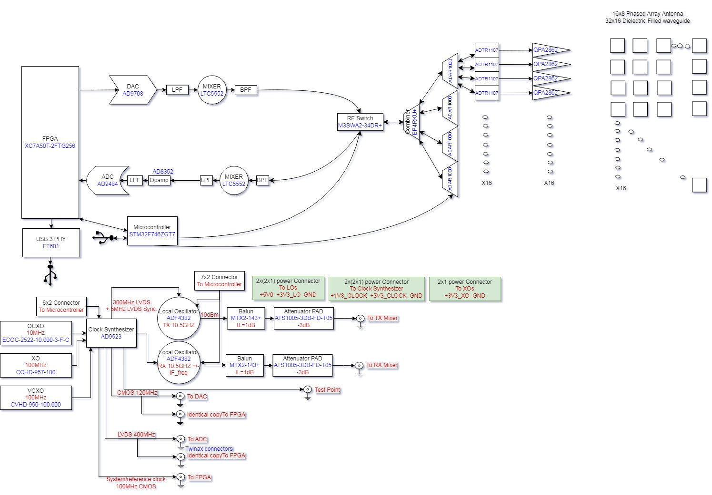

# XPA-105 Звіт Про Моделювання V2

## Статус І Походження

Це нормалізована українська Markdown-версія звіту про поточну FPGA-базову лінію та готовність до пусконалагодження.

- Поточне продуктове сімейство: `XPA-105`
- Активний набір назв: `XPA-105`
- Вихідний опублікований PDF: [XPA-105_Simulation_Report_v2_ua.pdf](/Users/sd/projects/PLFM_RADAR/docs/XPA-105_Simulation_Report_v2_ua.pdf)
- Спільний керований рисунок: [common assets](/Users/sd/projects/PLFM_RADAR/reports-src/assets/xpa-105-simulation-report-v2/common)

Мета цього файла не в буквальному відтворенні PDF. Він зберігає поточну інженерну базову лінію у формі, придатній для пошуку, перевірки й подальшого редагування.

## Підсумок Обкладинки

| Пункт | Значення |
| --- | --- |
| Сімейство продукту | XPA-105 |
| Тип звіту | Поточна FPGA та базова лінія пусконалагодження |
| Охоплення | Базова лінія після замикання таймінгу, стан debug-інструментування та готовність до апаратного пусконалагодження для XC7A200T |
| Дата | 2026-03-18 |
| Версія | 2.0 |

## 1. Підсумок Для Керівництва

Цей звіт замінює попередні підсумки, що спиралися лише на моделювання, оскільки тепер він прив'язаний до актуального апаратно-орієнтованого стану проєкту. Поточною виробничою ціллю є FPGA `XC7A200T-2FBG484I`, Build 13 зафіксований як базова лінія для пусконалагодження, а також уже сформовано і базовий бітстрім без ILA, і debug-версію з ILA. Перевірка охоплює regression suites, інтеграційні golden-match тести, CDC-рев'ю з waivers для підтверджених false positive, а також замикання таймінгу на імплементації.

| Метрика | Поточне значення | Статус |
| --- | --- | --- |
| FPGA-ціль | XC7A200T-2FBG484I | Поточна виробнича базова лінія |
| Замороження збірки | Build 13 (`build13_candidate_v1`) | Кандидат зафіксований |
| Таймінг (baseline) | WNS +0.311 ns / TNS 0.000 | PASS |
| Regression suites | 13/13 | PASS |
| Integration golden match | 2048 / 2048 | PASS |
| ILA debug build | 4 ядра, 92 біти, глибина 4096 | Згенеровано |
| Bring-up scripts | `program_fpga.tcl` + `ila_capture.tcl` | Готово |

## 2. Поточна Архітектурна Базова Лінія

Активний тракт сигналу, як і раніше, побудований навколо носія 10.5 GHz, ПЧ 120 MHz, ADC на 400 MSPS, CIC-децимації, FIR-очищення, узгодженої фільтрації та доплерівської обробки. Поточна політика апаратної верифікації вимагає не лише моделювання, а й перевірок, орієнтованих на імплементацію: таймінг, CDC, constraints і triage попереджень до виходу на фізичну плату.

Рисунок 2.1. Опорна архітектура, яку несе поточний current-state-звіт.

| Параметр | Значення |
| --- | --- |
| Несуча частота | 10.5 GHz |
| Проміжна частота (IF) | 120 MHz |
| Частота дискретизації ADC | 400 MSPS |
| Системний такт | 100 MHz |
| CIC-децимація | 4x |
| FFT matched filter | Ланцюжок на 1024 точки |
| Doppler FFT | 32 точки |
| Range bins | 64 |
| Chirps на кадр | 32 |

## 3. Перевірка Та Критерії Якості

| Гейт | Результат | Примітки |
| --- | --- | --- |
| Набори unit/co-sim тестів | PASS | Пройдено 13/13 regression suites |
| Integration testbench | PASS | 2048/2048 збіг із golden reference |
| CDC static analysis | PASS with waivers | 5 criticals підтверджені як false positive |
| DRC/methodology triage | Reviewed | Попередження класифіковані, неблокувальні задокументовані |
| Покриття constraints і таймінгу | PASS | На базовій лінії немає failing user timing constraints |

Ключовий урок проєкту: для sign-off перед виходом на апаратну плату одного лише моделювання недостатньо. Потрібні CDC-рев'ю, замикання таймінгу, triage methodology warnings і перевірка покриття constraints, інакше сюрпризи на пусконалагодженні майже гарантовані.

## 4. Debug-інструментування Та Готовність До Пусконалагодження

| Артефакт | Поточний стан |
| --- | --- |
| Базовий бітстрім | Згенеровано (без ILA) |
| Debug-бітстрім | Згенеровано з 4 ILA-ядрами |
| Покриття probe-сигналів | Загалом 92 біти |
| ILA timing | Домен 100 MHz чистий; debug-шлях 400 MHz має негативний slack і позначений як debug-use |
| Стратегія мапінгу нетів | Post-synth-пошук цільових нетів + стійке wildcard/pin-based розв'язання |

Скрипти пусконалагодження вже підготовлені та перевірені в потоці: програмування FPGA і структуровані сценарії ILA-capture. Це підтримує поетапне апаратне виконання: від перевірки `clock/reset` до валідації DDC, matched filter і range/doppler тракту.

## 5. Стратегія Міграції На Dev-Board

| Ціль | Top wrapper | Constraint file | Build script |
| --- | --- | --- | --- |
| Production | `radar_system_top` | `constraints/xc7a200t_fbg484.xdc` | project main flow |
| TE0712/TE0701 | `radar_system_top_te0712_dev` | `constraints/te0712_te0701_minimal.xdc` | `scripts/build_te0712_dev.tcl` |
| TE0713/TE0701 | `radar_system_top_te0713_dev` | `constraints/te0713_te0701_minimal.xdc` | `scripts/build_te0713_dev.tcl` |

Таке розділення цілей ізолює pinout і clocking, специфічні для плати, від ядра RTL. Це знижує ризик і дає змогу почати апаратні тести раніше на доступних у наявності модулях.

## 6. Ключовий Журнал Змін (Поточне Покоління)

| Commit | Зміни |
| --- | --- |
| `f6877aa` | Підготовка до Phase 1 bring-up: ILA debug probes, CDC waivers, programming scripts |
| `12e63b7` | Посилено скрипт вставки ILA: deferred core creation, net resolution, виправлення `MU_CNT` |
| `0ae7b40` | Додано split-target для TE0712/TE0701 з окремими top/XDC/build flow |
| `967ce17` | Додано альтернативну in-stock ціль TE0713/TE0701 |
| `fcdd270` | Опубліковано початкові docs і report PDF на GitHub Pages |
| `94eed1e` | Розгорнуто повну багатосторінкову engineering documentation site |

## 7. Висновок

XPA-105 перейшов від готовності, що спиралася лише на моделювання, до апаратно-орієнтованої базової лінії із замиканням таймінгу, надійним debug-інструментуванням і відтворюваними workflow пусконалагодження. Основний залишковий ризик тепер пов'язаний уже не з архітектурою або прогалинами у верифікації, а з реальною фізичною платою. Цей звіт слід вважати поточним опорним документом стану, який замінює старі simulation-only-підсумки.

Класифікація звіту: інженерна базова лінія (поточний стан).
